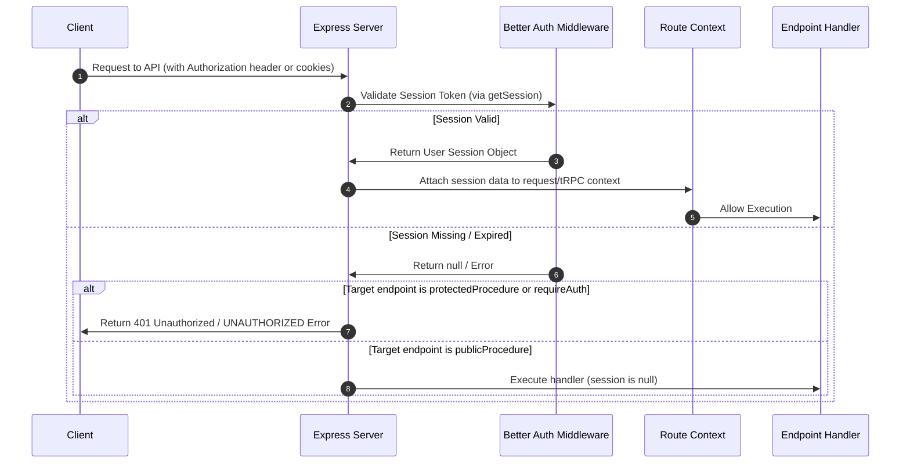

# CareerGPS Server Summary

This document provides a technical overview of the `apps/server` workspace in the CareerGPS monorepo. It outlines the codebase structure, database schema, API endpoints, authentication flows, validation patterns, key architectural decisions, and existing codebase gaps.

---

## 1. Codebase Structure

The server is built as an **Express** application integrating **tRPC** for type-safe RPC endpoints, **Better Auth** for session handling, and **Drizzle ORM** for database interaction.

```
apps/server/
├── drizzle.config.ts          # Drizzle ORM configuration
├── tsdown.config.ts           # tsdown build configuration
├── package.json
└── src/
    ├── index.ts               # Express entry point (CORS, mounts /api/auth, /trpc, and REST /cv)
    ├── db/
    │   ├── index.ts           # Drizzle database client initialization
    │   ├── migrations/        # SQL migration files generated by Drizzle Kit
    │   └── schema/
    │       └── index.ts       # Central schema export merging all module-level schemas
    ├── trpc/
    │   ├── index.ts           # tRPC server setup (defines publicProcedure, protectedProcedure)
    │   ├── context.ts         # tRPC request context builder (validates session with Better Auth)
    │   └── routers/
    │       └── index.ts       # AppRouter definition combining all module routers
    ├── shared/
    │   ├── auth/
    │   │   └── auth.ts        # Better Auth server configuration
    │   └── storage/
    │       └── cloudinary.ts  # Cloudinary file upload & deletion helper functions
    └── modules/               # Domain-driven feature directories
        ├── auth/              # Auth database tables and user creation tRPC routers
        ├── cv/                # REST file-upload handler, AI parser caller, and CV tRPC queries
        ├── github/            # Github API client, activity scorer, and repository skill analyzer
        ├── roles/             # Role mapping, user evaluation services, and role tRPC routers
        ├── skills/            # Skill/dependency management, user skill upserts, cycle detection
        ├── roadmap/          # Roadmaps, cache schema, gamification leaderboard, and HF AI planner
        └── profile/           # [Placeholder] Currently empty directory
```

---

## 2. Database Schema (Drizzle)

All database entities are managed via PostgreSQL tables. The schemas are distributed across modules and aggregated in `src/db/schema/index.ts`. There are **no soft-delete columns**; all deletions cascade hard. Timestamps default to creation time via `.defaultNow()`, and updates use `$onUpdate(() => new Date())`.

### Auth Module (`src/modules/auth/db/schema.ts`)
*   **`user`**
    *   Columns: `id` (text, PK), `name` (text), `email` (text, unique), `emailVerified` (boolean), `image` (text, nullable), `createdAt` (timestamp), `updatedAt` (timestamp).
    *   Relations: Has many `sessions` and `accounts`.
*   **`session`**
    *   Columns: `id` (text, PK), `expiresAt` (timestamp), `token` (text, unique), `createdAt` (timestamp), `updatedAt` (timestamp), `ipAddress` (text, nullable), `userAgent` (text, nullable), `userId` (text, FK references `user.id` on delete cascade).
    *   Indexes: `session_userId_idx` on `userId`.
*   **`account`**
    *   Columns: `id` (text, PK), `accountId` (text), `providerId` (text), `userId` (text, FK references `user.id` on delete cascade), `accessToken` (text, nullable), `refreshToken` (text, nullable), `idToken` (text, nullable), `accessTokenExpiresAt` (timestamp, nullable), `refreshTokenExpiresAt` (timestamp, nullable), `scope` (text, nullable), `password` (text, nullable), `createdAt` (timestamp), `updatedAt` (timestamp).
    *   Indexes: `account_userId_idx` on `userId`.
*   **`verification`**
    *   Columns: `id` (text, PK), `identifier` (text), `value` (text), `expiresAt` (timestamp), `createdAt` (timestamp), `updatedAt` (timestamp).
    *   Indexes: `verification_identifier_idx` on `identifier`.

### CV Module (`src/modules/cv/db/schema.ts`)
*   **`cv`**
    *   Columns: `id` (text, PK), `userId` (text, FK references `user.id` on delete cascade), `fileUrl` (text), `publicId` (text), `fileName` (text), `mimeType` (text), `parsedData` (jsonb, nullable), `status` (enum `cvStatus`: "pending", "parsing", "completed", "failed"), `errorMessage` (text, nullable), `createdAt` (timestamp), `updatedAt` (timestamp).
    *   Indexes: `cv_user_id_idx` on `userId`.

### GitHub Module (`src/modules/github/db/schema.ts`)
*   **`github_stats`**
    *   Columns: `userId` (text, PK, FK references `user.id` on delete cascade), `username` (text), `reposCount` (integer), `totalStars` (integer), `activityScore` (numeric), `lastSynced` (timestamp).
*   **`projects`**
    *   Columns: `id` (uuid, default random, PK), `userId` (text, FK references `user.id` on delete cascade), `title` (text), `description` (text, nullable), `source` (text), `complexityScore` (doublePrecision), `createdAt` (timestamp).
    *   Constraints: Unique index `userTitleUnique` on `(userId, title)`.

### Roles Module (`src/modules/roles/db/schema.ts`)
*   **`roles`**
    *   Columns: `id` (uuid, default random, PK), `title` (text, unique), `description` (text, nullable).
*   **`role_skills`** (Junction)
    *   Columns: `roleId` (uuid, FK references `roles.id` on delete cascade), `skillId` (uuid, FK references `skills.id` on delete cascade), `isCore` (boolean, default false).
    *   Primary Key: `(roleId, skillId)`.

### Skills Module (`src/modules/skills/db/schema.ts`)
*   **`skills`**
    *   Columns: `id` (uuid, default random, PK), `name` (text, unique), `hasNoDependencies` (boolean, default false).
*   **`skill_dependencies`** (Self-referencing Junction)
    *   Columns: `skillId` (uuid, FK references `skills.id` on delete cascade), `dependsOnSkillId` (uuid, FK references `skills.id` on delete cascade).
    *   Primary Key: `(skillId, dependsOnSkillId)`.
*   **`user_skills`** (Junction)
    *   Columns: `userId` (text, FK references `user.id` on delete cascade), `skillId` (uuid, FK references `skills.id` on delete cascade), `strengthScore` (numeric).
    *   Primary Key: `(userId, skillId)`.
*   **`project_skills`** (Junction)
    *   Columns: `projectId` (uuid, FK references `projects.id` on delete cascade), `skillId` (uuid, FK references `skills.id` on delete cascade).
    *   Primary Key: `(projectId, skillId)`.

### roadmap Module (`src/modules/roadmap/db/schema.ts`)
*   **`roadmaps`**
    *   Columns: `id` (uuid, default random, PK), `userId` (text, FK references `user.id` on delete cascade), `roleId` (uuid, FK references `roles.id` on delete cascade), `title` (text), `description` (text, nullable), `isActive` (boolean, default true), `createdAt` (timestamp), `updatedAt` (timestamp).
*   **`cached_internal_roadmaps`** (Global cache for AI-generated sub-plans)
    *   Columns: `id` (uuid, default random, PK), `skillId` (uuid, FK references `skills.id` on delete cascade), `level` (text), `durationDays` (numeric), `dailyMinutes` (numeric), `roadmapData` (jsonb), `createdAt` (timestamp).
    *   Constraints: Unique index `cached_internal_roadmap_unq` on `(skillId, level, durationDays, dailyMinutes)`.
*   **`roadmap_steps`**
    *   Columns: `id` (uuid, default random, PK), `roadmapId` (uuid, FK references `roadmaps.id` on delete cascade), `skillId` (uuid, FK references `skills.id` on delete cascade), `title` (text), `description` (text), `status` (text, default "pending"), `orderIndex` (numeric), `cachedRoadmapId` (uuid, FK references `cached_internal_roadmaps.id` on delete set null), `completedAt` (timestamp, nullable).
*   **`skill_gap_results`**
    *   Columns: `id` (uuid, default random, PK), `userId` (text, FK references `user.id` on delete cascade), `roleId` (uuid, FK references `roles.id` on delete cascade), `missingSkills` (jsonb - stores `{ missing: string[], weak: string[] }`), `matchScore` (numeric), `createdAt` (timestamp).
*   **`readiness_reports`**
    *   Columns: `id` (uuid, default random, PK), `userId` (text, FK references `user.id` on delete cascade), `roleId` (uuid, FK references `roles.id` on delete cascade), `skillMatchScore` (numeric), `generalGithubScore` (numeric), `overallReadinessScore` (numeric), `feedback` (text), `createdAt` (timestamp).

---

## 3. API Surface

### REST API (Express)
*   **`POST /cv/parse`**
    *   **Auth**: Protected (Custom `requireAuth` middleware using Better Auth cookies).
    *   **Input**: Multipart form-data under key `file` (validated in memory by Multer, only PDF under 5MB).
    *   **Output**: `{ cvId: string, status: "completed" | "failed", parsedData?: ParsedCVDataSchema, errorMessage?: string }` (Status 200) or `{ error: string }` (Status 400/401/500).
    *   **Purpose**: Upload CV to Cloudinary, submit to downstream AI Team parsing service, validate response format, and upsert parsing result.

### tRPC API
tRPC procedures are partitioned by router namespace.

| Procedure Name | Type | Auth | Input Schema | Output Shape | One-Line Purpose |
| :--- | :--- | :--- | :--- | :--- | :--- |
| **`auth.createUser`** | mutation | Public | `{ id: string, name: string, email: string }` | `User` DB Object | Syncs user details after social login / registration callback. |
| **`cv.getStatus`** | query | Protected | `{ cvId: UUID }` | `{ status: cvStatus, errorMessage: string \| null }` | Gets current parsing status and error details for a uploaded CV. |
| **`cv.getLatestCV`** | query | Protected | None | `CV` DB Object | Fetches meta-information of user's most recently uploaded CV. |
| **`cv.getCV`** | query | Protected | `{ cvId: UUID }` | `CV` DB Object | Fetches a specific CV record. |
| **`cv.getAllCVs`** | query | Protected | None | `CV[]` DB Objects | Returns list of all CV files uploaded by the active user. |
| **`cv.getParsedData`** | query | Protected | `{ cvId: UUID }` | `{ parsedData: ParsedCVDataSchema }` | Fetches JSON parsing contents of a successfully parsed CV. |
| **`cv.deleteCV`** | mutation | Protected | `{ cvId: UUID }` | `{ success: boolean }` | Deletes CV from Cloudinary and removes its row from the database. |
| **`github.syncProjects`** | mutation | Public | `{ userId: string, username: string }` | `{ repoCount: number, activityScore: number }` | Triggers GitHub crawler to analyze repositories, contributions, and extract skills. |
| **`github.getStats`** | query | Public | `{ userId: string }` | `GithubStats` DB Object | Retrieves aggregated GitHub activity stats for a user. |
| **`github.getProjects`** | query | Public | `{ userId: string }` | `Project[]` DB Objects | Returns crawled and manual projects for user, sorted by complexity. |
| **`github.addManualProject`** | mutation | Public | `{ userId: string, title: string, description?: string, complexityLevel: "simple"\|"moderate"\|"complex" }` | `Project` DB Object | Allows manual entry of a project with preset scores (5, 15, 30). |
| **`roles.create`** | mutation | Public | `{ title: string }` | `Role` DB Object | Declares or updates a career role title. |
| **`roles.addSkill`** | mutation | Public | `{ roleId: UUID, skillId: UUID, isCore: boolean }` | `RoleSkill` Junction Object | Assigns a skill dependency to a role. |
| **`roles.getAllRoles`** | query | Public | None | `Role[]` DB Objects | Retrieves list of all roles sorted alphabetically. |
| **`roles.getRoleById`** | query | Public | `{ roleId: UUID }` | `Role` with embedded nested skills | Fetches specific role info along with associated core/bonus skills. |
| **`skills.create`** | mutation | Protected | `{ name: string, hasNoDependencies: boolean, dependencyIds?: string[] }` | `Skill` DB Object | Creates a skill and dependencies, performing cycle detection. |
| **`skills.addUserSkill`** | mutation | Protected | `{ skillId: UUID, strengthScore: number }` | `{ userId, skillId, skillName, strengthScore }` | Inserts or updates user skill strength score (clamped between 0-100). |
| **`skills.updateUserSkill`** | mutation | Protected | `{ skillId: UUID, strengthScore: number }` | `{ userId, skillId, strengthScore }` | Modifies strength value of an already mapped user skill. |
| **`skills.getUserSkills`** | query | Protected | None | `{ userId, skillId, skillName, strengthScore }[]` | Returns the active user's current mapped skill profile. |
| **`skills.getAllSkills`** | query | Protected | None | `Skill[]` DB Objects | Returns all system-declared skills. |
| **`skills.addManualSkill`** | mutation | Protected | `{ skillName: string, level: "beginner"\|"intermediate"\|"expert" }` | `{ skillId, skillName, level, strengthScore }` | Maps skill to active user with base levels (beginner=30, intermediate=60, expert=90). |
| **`roadmap.generate`** | mutation | Public | `{ userId: string, roleName: string }` | `{ totalSteps, roadmap }` or `{ message: string }` | Triggers topological sorting of missing skills to generate active roadmap. |
| **`roadmap.completeStep`** | mutation | Public | `{ userId: string, stepId: UUID }` | Completion results + new skill strength | Completes a roadmap step, increments skill strength by +15, and triggers background score update. |
| **`roadmap.getActiveRoadmap`** | query | Public | `{ userId: string, roleId: string }` | Active `Roadmap` with ordered steps | Retrieves current active learning roadmap for specified role. |
| **`roadmap.generateSkillInternalRoadmap`** | mutation | Public | `{ stepId: UUID, durationDays?: number, dailyMinutes?: number }` | Learning sub-plan JSON | Generates (HF AI or mock) a daily study timeline for a single skill step. |
| **`readiness.generate`** | mutation | Public | `{ userId: string, roleName: string }` | Full evaluation metrics output | Performs readiness assessment, calculates scores, and inserts reports. |
| **`readiness.getLatestReport`** | query | Public | `{ userId: string, roleId: string }` | `{ report, gaps }` | Fetches last calculated report and list of skill gaps. |
| **`readiness.getGlobalLeaderboard`** | query | Public | `{ limit?: number }` | Gamified leaderboard entries | Ranks users by overall score and computes tier labels. |
| **`readiness.getRoleLeaderboard`** | query | Public | `{ roleId: UUID, limit?: number }` | Leaderboard entries for role | Ranks users specifically competing for a single role. |

---

## 4. Auth & Session Flow

The server leverages **Better Auth** for session validation.



### Authentication Checks Location
*   **REST Routing**: Custom route-level helper `requireAuth` runs inside `modules/cv/routes/restful_route.ts`. It parses Node headers via `fromNodeHeaders` and queries `auth.api.getSession(req)`.
*   **tRPC Routing**: Middleware-level. `createContext` (defined in `src/trpc/context.ts`) pulls session data on every request. `protectedProcedure` (defined in `src/trpc/index.ts`) blocks execution and throws a `TRPCError` with code `UNAUTHORIZED` if `ctx.session` is missing.
*   **Public Endpoints Security**: Many public procedures take `userId: z.string()` in their input parameters. No session token checks are performed on these routes (see Gaps).

---

## 5. Validation Patterns

*   **tRPC Input Validation**: Handled inline within router files using `z.object()`, validating types, string constraints, and UUID structures.
*   **Downstream Service Responses**: The response of the CV parsing endpoint is strictly validated using a schema defined in `src/modules/cv/parsedCv_schema.ts`.
    *   **Naming Conventions**: PascalCase is preferred for schemas (e.g. `ParsedCVDataSchema`, `ExperienceSchema`), while camelCase is used for root endpoints schemas (`responseBodySchema`).
    *   **Type Sharing (`z.infer`)**: Type signatures are exported using `z.infer<typeof Schema>` (e.g. `ParsedCVData`, `Skill`, etc.) for internal types in the backend.
*   **Frontend Monorepo Sharing**: The monorepo has a shared workspace package `@careergps/shared` with a `src/zod` folder, but it is currently empty. Validation schemas are defined locally within `apps/server` and not distributed yet.

---

## 6. Architectural Decisions Worth Remembering

### REST vs tRPC Boundary
*   The API layer is built using tRPC for end-to-end type safety between client and server.
*   The upload functionality is segregated into Express REST endpoint (`POST /cv/parse`) because tRPC lacks simple, out-of-the-box streaming and file/multipart parsing middleware.

### Downstream Integrations (File Upload & Parsing)
*   **Multer** intercepts incoming uploads as standard memory buffers (under 5MB).
*   The PDF buffer is uploaded directly to **Cloudinary** returning a URL.
*   The Cloudinary URL is then submitted to an external AI CV Parser API (`${env.AI_TEAM_URL}/parse`). The response must confirm status `completed` or `failed` and return matching `cvId` before database persistence.

### Readiness Scoring & Gamification Algorithm
Readiness is computed via `evaluateUserForRoleInternal` using weighted parameters:
1.  **Skills (60%)**: Skill match score against core role requirements.
2.  **Projects (25%)**: Project complexity scores from GitHub contributions and manual entries.
3.  **GitHub (15%)**: General activity score combined with project/skill alignment scores.
*   **Strict Missing-Skill Cap**: If the user lacks even a single core role skill, their final score is **capped at 49%** (failing grade), regardless of their GitHub activity or project scores.
*   **Gamification Tiers**: Leaderboards calculate tiers ("Bronze", "Silver", "Gold", "Platinum", "Diamond") using overall readiness scores and activity metrics.

### Dependency Sorting (Kahn's Topological Sort)
*   When a roadmap is requested, the server fetches the user's missing and weak skills.
*   It fetches skill dependencies (`skill_dependencies`) and constructs a Directed Acyclic Graph (DAG).
*   It performs **Kahn's algorithm for topological sorting** to resolve the sequence of learning.
*   If a cycle is detected during skill definition (using DFS) or roadmap compilation (Kahn's queue length mismatch), the transaction is rolled back with a validation error.

### Error Handling & Transaction Safety
*   **CV Parse Cleanup**: If the external CV parser fails or the payload is invalid, the catch block catches the error, deletes the uploaded asset from Cloudinary using `deleteFromCloudinary(publicId)`, and updates the database record status to `"failed"`.
*   **Global Express Error Boundary**: A global Express middleware handles `MulterError` and general exceptions to prevent server crashes and return consistent JSON structures.

---

## 7. Gaps & Security Concerns

> [!WARNING]
> **1. Public tRPC Route Vulnerabilities (ID Snooping)**
> tRPC routes in `githubRouter`, `rolesRouter`, `roadmapRouter`, and `readinessRouter` use `publicProcedure` and accept a raw `userId: z.string()` input parameter instead of extracting the user ID from `ctx.session`. This allows any authenticated or anonymous client to query or modify projects, sync roadmaps, complete steps, or fetch readiness reports for any arbitrary user by simply providing their database text ID.

> [!CAUTION]
> **2. Cloudinary resource_type Deletion Mismatch**
> In `src/shared/storage/cloudinary.ts`:
> *   Files are uploaded using `resource_type: "image"`.
> *   Deletions call `destroy(publicId, { resource_type: "raw" })`.
> Because of this mismatch, Cloudinary will fail to find and delete the uploaded PDF file during cleanup, resulting in orphaned storage usage.

> [!NOTE]
> **3. Monorepo Shared Package is Empty**
> The monorepo setup defines a package `@careergps/shared`, but the `packages/shared/src/zod` folder is empty (save for a `.gitkeep`). The frontend and backend define duplicate schema definitions.

> [!NOTE]
> **4. Profile Module is Unimplemented**
> The folder `src/modules/profile/` contains no code. Any profile management endpoints are currently missing.
